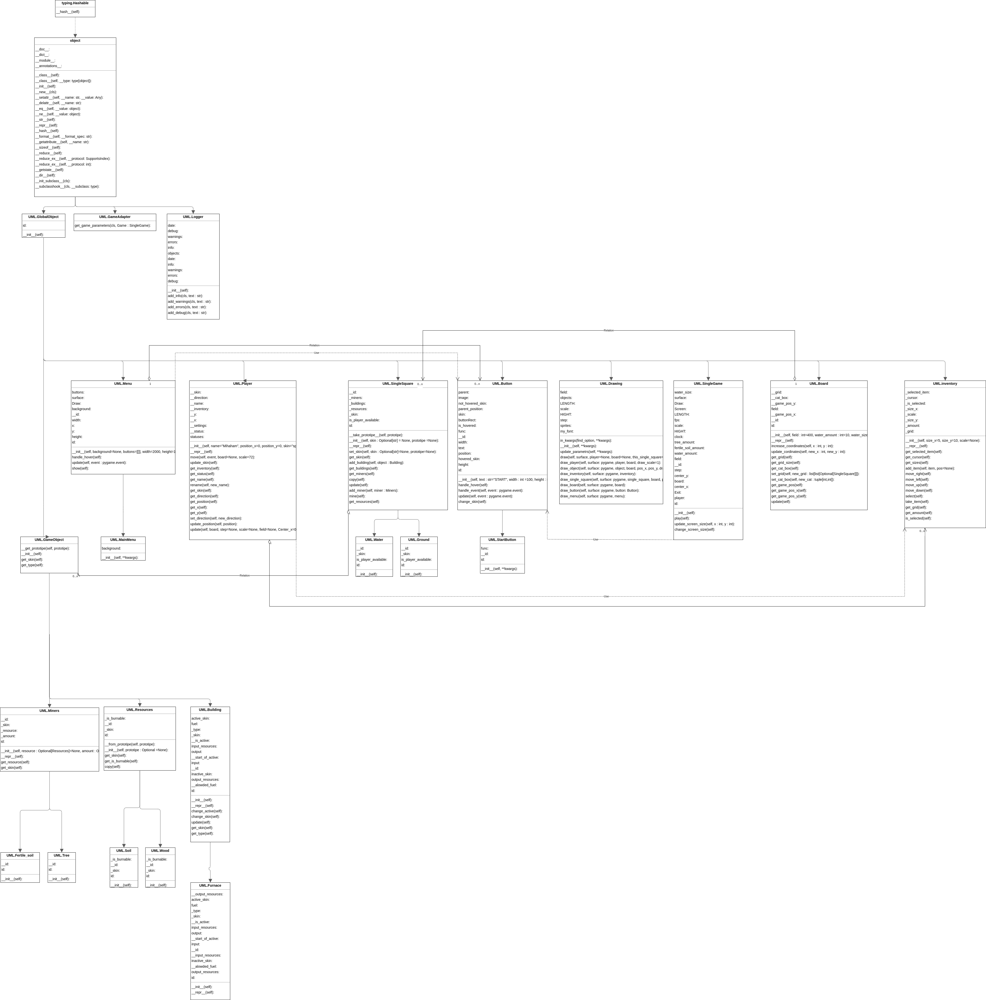
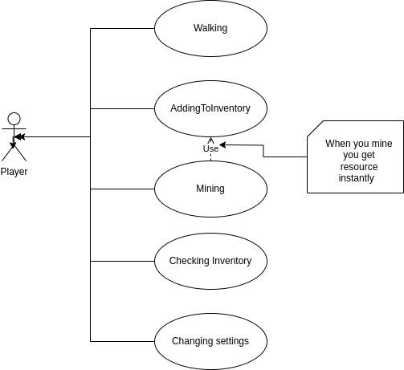

# RUSSIANSCRAPORIO

## О проекте

Легенда: путешествуя по космосу игроки попадают в космическую катастрофу, после чего падают на
планету, которая еще не
заселена. Им придется выживать на этой планете, добывать ресурсы, чтобы в дальнейшем купить у
Дядюшки Mihahama
космический корабль.

В начале у вас будет всего лишь печь, с помощью которой вы сможете обработать свои первые ресурсы.

Во время разработки проекта использовались следующие паттерны проектирования:

1. Factory method (GameObject) - Стандартная практика для создания игровых объектов
2. Multiton (Logger) - Необходим доступ ко всем обьектам для реализации Debug консоли
3. Prototype (Drawing) - Для того, чтобы несколько раз не подгружать обьекты, не захломлять память
4. Singleton (Logger) - Необходимо, чтобы все обьекты лежали в одном логгере и логи одной игры не
   были разделены по нескольким файлам.

## Запуск проекта

Чтобы запустить игру вам необходимо будет выполнить следующие команды

### Необходимые компоненты

Для запуска проекта вам необходимо иметь на компьютере установленную версию Python версии не ниже
3.6
Также необходима система контроля версий git

### Установка

1. Клонирования репозитория
   ```sh
   git clone git@github.com:Mihaham/RussianScraporioGame.git
   ```
2. Установка зависимостей
   ```sh
   pip install -r requirements.txt
   ```
3. Запустить проект
   ```py
   python main.py
   ```

## Использование

Процесс игры:
Игрок может передвигаться по открытому миру:

1. **W** - вверх
2. **A** - влево
3. **S** - вниз
4. **D** - вправо
5. **I** - открытие/закрытие инвентаря
6. **ENTER** - активация предмета/добыча ресурсов/выбор ячейки инвентаря.
7. **Q** - выход из игры

## Возможные ошибки

Если при запуске игры игрок попал в поле с водой, то необходимо перезапустить игру, так как далее
игрок не сможет
перемещаться по игровому полю

## Документация

[Документация](Documentation.odt)

[UML диаграмма классов](UML/UMLclassesNew.drawio.png)

[UML диаграмма вариантов использования](UML/UMLuse.png)

Московский физико-технический институт (государственный университет)

#

<a name="__ddelink__862_3068200969"></a>Проектное задание по курсу

«Технологии программирования»

RussianScraporioGame

Выполнили:
Городецкий Михаил, группа Б05-323

**Оглавление**

[1. Постановка задачи 3](#__refheading___toc284_3509981118)

[1.1 Состав первого задания	4](#__refheading___toc286_3509981118)

[1.2 Описание задачи	4](#__refheading___toc238_3509981118)

[2. Описание предметной области	4](#__refheading___toc240_3509981118)

[2.1 Логическая модель игровой области	4](#__refheading___toc242_3509981118)

[2.2 Описания и обязанности классов	7](#__refheading___toc244_3509981118)

[3. Описание функциональных требований к системе	8](#__refheading___toc246_3509981118)

[3.1 Модель вариантов использования	8](#__refheading___toc248_3509981118)

#

#

# <a name="__refheading___toc284_3509981118"></a>**1. Постановка задачи**

# <a name="__refheading___toc286_3509981118"></a>**1.1 Состав первого задания**

`    `Первое задание состоит в представлении модели реализации проекта, выяснении тонкостей, которые
могут возникнуть при этом. Дополнительно, строятся уточненные взаимодействия между компонентами
системы, учитывая варианты использования и строиться планы тестирования.

`    `Все варианты использования выполнил Городецкий Михаил.

1. ## <a name="__refheading___toc238_3509981118"></a>**1.2 Описание задачи**
   `    `Игра состоит из исследования мира пользователем. Пользователь может передвигаться по
   открытому миру. Каждая клетка открытого мира может быть одним из следующих типов: вода, земля.
   Пользователю запрещено передвигаться по воде.

   `    `Передвигаясь по открытому миру, у игрока появляется возможность собирать ресурсы. Добытые
   ресурсы добавляются сервисом в сущность инвентарь. У пользователя есть возможность открыть
   инвентарь и осмотреть его содержимое.

   `    `Инвентарь хранится в виде матрицы предметов

   `    `Каждая игра хранит игровое поле, обьекты игроков.

   `    `Предполагается, что в произвольный момент времени по игровому полю может передвигаться
   произвольное число игроков.
1. # <a name="__refheading___toc240_3509981118"></a>**2. Описание предметной области**
    1. ## <a name="__refheading___toc242_3509981118"></a>**2.1 Логическая модель игровой области**
       `    `На рисунке 1 приведена диаграмма классов после рассмотрения логической модели.


На данной диаграмме видна диаграмма игровой области, которая показывает свящь между обьектами
игровой области. Заметим, что Board хранит свои поля SingleSquares. У пользователя может возникнуть
потребность в нескольких инвентарях (например, при последующей реализации сущности рюкзак), поэтому
они связаны соотношнием N:1. Для реализации возможных состояний игроков реализована внутренняя
сущность игрока — statuses.

1. ## <a name="__refheading___toc244_3509981118"></a>**2.2 Описания и обязанности классов**
   *Таблица 1: Обязанности и коллеги классов игровой области*

| Класс         | Контракт                                                                                                                                                                                                                                                                                                                              | Коллеги                                                                   |
|:--------------|:--------------------------------------------------------------------------------------------------------------------------------------------------------------------------------------------------------------------------------------------------------------------------------------------------------------------------------------|:--------------------------------------------------------------------------|
| Player        | <p>Хранит позицию игрока</p><p>Хранит настройки игрока</p><p>Хранит инвентарь игрока</p><p>Предоставляет возможность передвижения игрока</p><p></p>                                                                                                                                                                                   | <p>Inventory</p><p>Board</p>                                              |
| Board         | <p>Хранит отдельные клетки игрового поля</p><p>Хранит смещения игрового поля относительно отображенной области</p><p>Предоставляет возможность обновить информацию в отдельной клетке игровой области</p>                                                                                                                             | SingleSquare                                                              |
| SingleSquare  | <p>Хранит информацию о доступности поля для игрока</p><p>Хранит информацию о строениях на данной клетке</p><p>Хранит информацию о майнерах на данной клетке</p><p>Хранит информацию о ресурсах на данной клетке</p><p>Предоставляет возможность получить информацию об обьектах на данной клетке</p><p>Предоставляет возможность </p> | <p>Buildings</p><p>Miners</p><p>Resources</p>                             |
| Inventory     | <p>Хранит объекты игрока</p><p>Предоставляет возможность добавления предметов</p><p>Предоставляет возможность взятия предметов</p><p></p>                                                                                                                                                                                             | Object                                                                    |
| Logger        | Предоставляет возможность сохранения всей информации о конкретной игровой сессии                                                                                                                                                                                                                                                      |                                                                           |
| Drawing       | Предоставляет возможность вывода изображения на экран                                                                                                                                                                                                                                                                                 | <p>Player</p><p>Object</p><p>Inventory</p><p>Board</p><p>SingleSquare</p> |
| Object        | Предоставляет возможность для отрисовки обьекта                                                                                                                                                                                                                                                                                       |                                                                           |
| Miners        | <p>Хранит тип ресурса, который добывается</p><p>Хранится количество ресурса, который можно добыть</p><p>Предоставляет возможность добыть ресурс</p>                                                                                                                                                                                   | Resources                                                                 |
| Resources     | Хранит информацию о возможности использовать данный тип в качестве источника энергии                                                                                                                                                                                                                                                  |                                                                           |
| Buildings     | <p>Хранит информацию об активации здания</p><p>Хранит информацию о возможных ресурсах, которые могут быть обработаны в данном здании</p><p>Хранит информацию о выходном ресурсе</p><p>Предоставляет возможность обработать ресурс</p>                                                                                                 | Resources                                                                 |
| Tree          | Предоставляет возможность добыть ресурс Дерево                                                                                                                                                                                                                                                                                        |                                                                           |
| Fertile\_soil | Предоставляет возможность добыть ресурс Плодородная почва                                                                                                                                                                                                                                                                             |                                                                           |
| Wood          | Может быть использован в качестве ресурса для переработки/крафта                                                                                                                                                                                                                                                                      |                                                                           |
| Soil          | Может быть использован в качестве ресурса для переработки/крафта                                                                                                                                                                                                                                                                      |                                                                           |
| Water         | Предоставляет возможность размещения водных объектов                                                                                                                                                                                                                                                                                  |                                                                           |
| Ground        | Предоставляет возможность размещения объектов                                                                                                                                                                                                                                                                                         |                                                                           |

1. # <a name="__refheading___toc246_3509981118"></a>**3. Описание функциональных требований к
   системе**
    1. ## <a name="__refheading___toc248_3509981118"></a>**3.1 Модель вариантов использования**
       В описании системы упоминается Игрок.

       Игроку дается возможность исследовать мир(перемещаться по игровой области)

       Так же у Игрока есть возможность добывать ресурс.

       У Игрока так же имеется возможность добавлять предмет в свой инвентарь. Данная возможность
       выделена в отдельный вариант использования, так как она важна сама по себе.

       Так же игрок может выбрать свой инвентарь и получить информацию о предметах, находящихся в
       нем.

       У пользователя есть возможность изменять настройки игрока



1. ## **3.2 Вариант использования Walking**
   **Акторы**: Player (Игрок)

   **Цель**: Игрок хочет переместиться по игровому полю

   **Предусловия**: Игрок запустил игровую сессию

   **Постусловия**: Игрок переместился по игровому полю

   **Основной сценарий**:

1) Игрок запрашивает перемещения спрайта игрока по игровому полю.
1) Система проверяет, что статус игрока позволяет перемещаться по игровому полю
1) Система проверяет, что игрок может переместиться по игровому полю
1) Игрок перемещается по игровому полю.

**Алтернативный сценарий:**

Если на шаге 3 игроку не разрешается перейти на соответствующую клетку игрового поля или игровое
поле закончилось

1. Игрок остается на месте. В системе создается запись о том, что игрок не смог передвинуться на
   соответствующую клетку.

**Альтернативный сценарий:**

Если на шаге 1 игроку не разрешается переходить по игровому полю, то

1. Игрок остается на месте. В системе создается запись о том, что игрок не смог передвинуться на
   соответствующую клетку из-за неверного состояния.
    1. ## **3.3 Вариант использования AddingToInventory**
       **Акторы**: Player (Игрок)

       **Цель**: Игрок хочет добавить предмет в свой инвентарь

       **Предусловия**: Игрок запустил игровую сессию. Есть предмет, который необходимо добавить в
       инвентарь

       **Постусловия**: Количество предметов данного типа увеличилось на 1 в инвентаре игрока

       **Основной сценарий**:

1. Игрок запрашивает добавление предмета в инвентарь. Система обрабатывает данный запрос и
   увеличивает количество предметов данного типа на 1

**Альтернативный сценарий 1:**

Если на шаге 1 игроку предмета данного типа в инвентаре еще не существует, то

1. Система проверяет, есть ли в инвентаре свободная ячейка
1. Предмет добавляется в данную свободную ячейку

**Альтернативный сценарий 2:**

Если на шаге 1 алтернативного сценария 1 система не смогла найти свободную ячейку в инвентаре, то

1. Система сохраняет ошибку о невозможности добавить предмет в инвентарь
1. Предмет остается на прежнем месте
    1. ## **3.4 Вариант использования Mining**
       **Акторы**: Player (Игрок)

       **Цель**: Игрок хочет добыть ресурс

       **Предусловия**: Игрок запустил игровую сессию

       **Постусловия**: У игрока в инвентаре увеличилось количество предметов на 1

       **Основной сценарий**:

1. Игрок запрашивает майнинг у системы.
1. Система выполняет запрос ресурса у сущности Miner.
1. Выполняется сценарий AddingToInventory
    1. ## **3.5 Вариант использования CheckingInventory**
       **Акторы**: Player (Игрок)

       **Цель**: Игрок хочет посмотреть содержимое инвентаря

       **Предусловия**: Игрок запустил игровую сессию

       **Постусловия**: Игрок видет содержимое своего инвентаря

       **Основной сценарий**:

1. Игрок запрашивает отображение содержимого своего инвентаря
1. Система проверяет, что у игрока есть инвентарь
1. Система отображает содержимое всех инвентарей игрока
    1. ## **3.6 Вариант использования Changing Settings**
       **Акторы**: Player (Игрок)

       **Цель**: Игрок хочет изменить настройки игры

       **Предусловия**: Игрок запустил игровую сессию

       **Постусловия**: У игрока открыто меню с настройками, которые он может изменять.

       **Основной сценарий**:

1. Игрок делает запрос в систему об изменении настроек игры
1. Система останавливает игровой процесс и открывает меню настроек
   <a name="pagenumwizard_footer_базовый1_копия_2"></a>11


## Контакты

Mihaham - [@Mihaham](https://t.me/Mihaham) - mihaham1910@gmail.com


